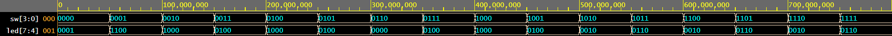

# Lab 4: Dávid Kováč

### LED(7:4) indicators
Complete the decoder truth table for **common anode** 7-segment display.

   | **Symbol** | **Inputs** | **a** | **b** | **c** | **d** | **e** | **f** | **g** |
   | :-: | :-: | :-: | :-: | :-: | :-: | :-: | :-: | :-: |
   | 0 | 0000 | 0 | 0 | 0 | 0 | 0 | 0 | 1 |
   | 1 | 0001 | 1 | 0 | 0 | 1 | 1 | 1 | 1 |
   | 2 | 0010 | 0 | 0 | 1 | 0 | 0 | 1 | 0 |
   | 3 | 0011 | 0 | 0 | 0 | 0 | 1 | 1 | 0 |
   | 4 | 0100 | 1 | 0 | 0 | 1 | 1 | 0 | 0 |
   | 5 | 0101 | 0 | 1 | 0 | 0 | 1 | 0 | 0 |
   | 6 | 0110 | 0 | 1 | 0 | 0 | 0 | 0 | 0 |
   | 7 | 0111 | 0 | 0 | 0 | 1 | 1 | 1 | 1 |
   | 8 | 1000 | 0 | 0 | 0 | 0 | 0 | 0 | 0 |
   | 9 | 1001 | 0 | 0 | 0 | 0 | 1 | 0 | 0 |
   | A | 1010 | 0 | 0 | 0 | 1 | 0 | 0 | 0 |
   | b | 1011 | 1 | 1 | 0 | 0 | 0 | 0 | 0 |
   | C | 1100 | 0 | 1 | 1 | 0 | 0 | 0 | 1 |
   | d | 1101 | 1 | 0 | 0 | 0 | 0 | 1 | 0 |
   | E | 1110 | 0 | 1 | 1 | 0 | 0 | 0 | 0 |
   | F | 1111 | 0 | 1 | 1 | 1 | 0 | 0 | 0 |
   
1. Complete the truth table for LEDs(7:4) according to comments in source code.

   | **Hex** | **Inputs** | **LED4** | **LED5** | **LED6** | **LED7** |
   | :-: | :-: | :-: | :-: | :-: | :-: |
   | 0 | 0000 | 1 | 0 | 0 | 0 |
   | 1 | 0001 | 0 | 0 | 1 | 1 |
   | 2 | 0010 | 0 | 0 | 0 | 1 |
   | 3 | 0011 | 0 | 0 | 1 | 0 |
   | 4 | 0100 | 0 | 0 | 0 | 1 |
   | 5 | 0101 | 0 | 0 | 1 | 0 |
   | 6 | 0110 | 0 | 0 | 0 | 0 |
   | 7 | 0111 | 0 | 0 | 1 | 0 |
   | 8 | 1000 | 0 | 0 | 0 | 1 |
   | 9 | 1001 | 0 | 0 | 1 | 0 |
   | A | 1010 | 0 | 1 | 0 | 0 |
   | b | 1011 | 0 | 1 | 1 | 0 |
   | C | 1100 | 0 | 1 | 0 | 0 |
   | d | 1101 | 0 | 1 | 1 | 0 |
   | E | 1110 | 0 | 1 | 0 | 0 |
   | F | 1111 | 0 | 1 | 1 | 0 |

2. Listing of LEDs(7:4) part of VHDL architecture from source file `top.vhd`. Try to write logic functions as simple as possible. Always use syntax highlighting, meaningful comments, and follow VHDL guidelines:

   ```vhdl
   with SW select          --0 to 3--
    LED(7 downto 4) <=  "0001" when "0000", --1
                        "1100" when "0001", --12/C
                        "1000" when "0010",	--8
                        "0100" when "0011",	--4
                        --4 to 7--
                        "1000" when "0100",	--8
                        "0100" when "0101",	--4
                        "0000" when "0110",	--0
                        "0100" when "0111",	--4
                        --8 to 11
                        "1000" when "1000",	--8
                        "0100" when "1001",	--4
                        "0010" when "1010",	--2
                        "0110" when "1011",	--6
                        --12 to 15
                        "0010" when "1100",	--2
                        "0110" when "1101",	--6
                        "0010" when "1110",	--2
                        "0110" when others;	--6
   ```

3. Screenshot with simulated time waveforms for LED(7:4). Always display all inputs and outputs (display the inputs at the top of the image, the outputs below them) at the appropriate time scale!

   
