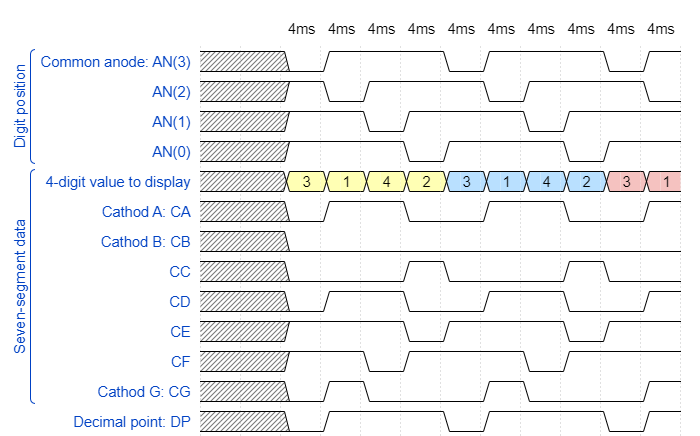
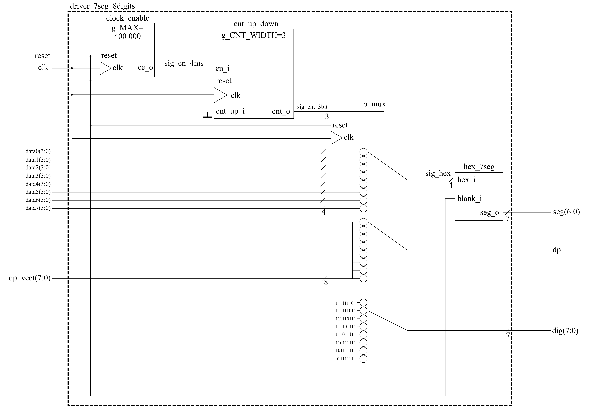

# Lab 7: Dávid Kováč

### Display driver

## Pre-Lab preparation
   

   > The figure above was created in [WaveDrom](https://wavedrom.com/) digital timing diagram online tool. The source code is as follows:
   >
   ```javascript
   {
  signal:
  [
    ['Digit position',
      {name: 'Common anode: AN(3)', wave: 'xx01..01..01'},
      {name: 'AN(2)', wave: 'xx101..01..0'},
      {name: 'AN(1)', wave: 'xx1.01..01..'},
      {name: 'AN(0)', wave: 'xx1..01..01.'},
    ],
    ['Seven-segment data',
      {name: '4-digit value to display', wave: 'xx3333555599', data: ['3','1','4','2','3','1','4','2','3','1']},
      {name: 'Cathod A: CA', 	wave: 'xx01.0.1.0.1'},
      {name: 'Cathod B: CB', 	wave: 'xx0.........'},
      {name: 'CC', 				wave: 'xx0..10..10.'},
      {name: 'CD', 				wave: 'xx01.0.1.0.1'},
      {name: 'CE', 				wave: 'xx1..01..01.'},
      {name: 'CF', 				wave: 'xx1.01..01..'},
      {name: 'Cathod G: CG', wave: 'xx010..10..1'},
    ],
    {name: 'Decimal point: DP', wave: 'xx01..01..01'},
  ],
  head:
  {
    text: '                    4ms   4ms   4ms   4ms   4ms   4ms   4ms   4ms   4ms   4ms',
  },
}
   ```

<a name="part1"></a>

1. Listing of VHDL code of the completed process `p_mux`. Always use syntax highlighting, meaningful comments, and follow VHDL guidelines:

```vhdl
    --------------------------------------------------------
    -- p_mux:
    -- A sequential process that implements a multiplexer for
    -- selecting data for a single digit, a decimal point,
    -- and switches the common anodes of each display.
    --------------------------------------------------------
	p_mux : process (clk) is
	begin

		if (rising_edge(clk)) then
			if (rst = '1') then
				sig_hex <= data0;
				dp      <= dp_vect(0);
				dig     <= "1110";
			else
        			case sig_cnt_2bit is
          				when "11" =>
            					sig_hex <= data3;
                        			dp      <= dp_vect(3);
                        			dig     <= "0111";
          				when "10" =>
            					sig_hex <= data2;
            					dp      <= dp_vect(2);
            					dig     <= "1011";
         			 	when "01" =>
            					sig_hex <= data1;
            					dp      <= dp_vect(1);
            					dig     <= "1101";
          				when others =>
           					sig_hex <= data0;
            					dp      <= dp_vect(0);
            					dig     <= "1110";
       			 	end case;
      			end if;
    		end if;

  end process p_mux;
```

### Eight-digit driver

1. Image of the 8-digit driver's block schematic. The image can be drawn on a computer or by hand. Always name all inputs, outputs, components, and internal signals!

   
