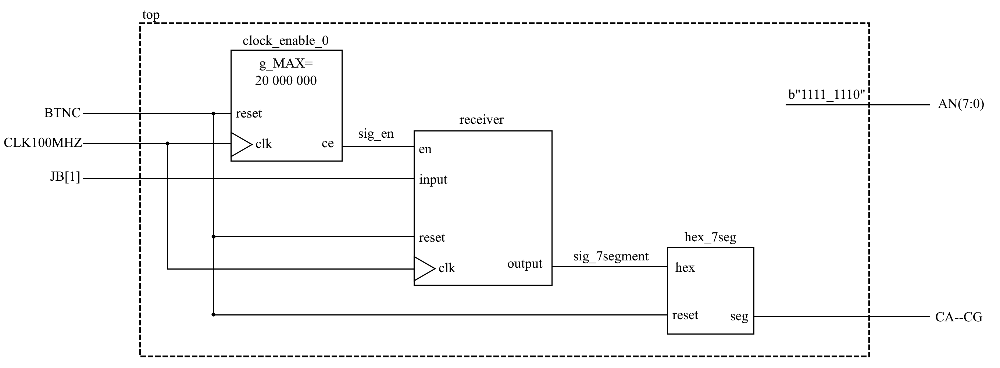

# Morse code transmitter and receiver/decoder VHDL project

### Team members

* Čipl Jan 		|240600| (responsible for writing top.vhd files, modifying hex7seg files)
* Kováč Dávid 	|214079| (responsible for writing Input and Receiver code)
* Mucha Vojtěch |240956| (responsible for writing the Generator code)

## Theoretical description and explanation

[comment]: <> (Enter a description of the problem and how to solve it.)

Our task was to create software writen in **VHDL** for the **NEXYS-A7-50T** boards that would allow said board to trasmit and receive Morse codes. The software is made out of two parts:

* The ***Transmitter*** which allows the user to easily input dots and dashes and the board would translate and generate said input into morse code waves in the form of High and low voltage levels.
* The ***Receiver*** which would take the generated output from the transmitter and translate and display the recieved letters or numbers on the 7 segment display.

## Hardware description of demo application

[comment]: <> (Insert descriptive text and schematics of your implementation.)

### The Transmitter
The input for the transmitter are the left and the right buttons on the **NEXYS-A7-50T** board, where left represents dot and right represents dash. The output of the transmitter is the first JA port.

### The Receiver
The input port for the receiver is the first JB port and the output of the receiver is displayed on the right most 7 segment display. 

## Software description

[comment]: <> (Put flowchats/state diagrams of your algorithms and direct links to source/testbench files in `src` and `sim` folders.)

* **Input** - [SRC](https://github.com/JanCipl/digital-electronics-1/blob/main/09-project/final_project/final_project.srcs/sources_1/new/input.vhd) [SIM](https://github.com/xkovac52/digital-electronics-1/blob/main/labs/Project/project_morse/project_morse.srcs/sim_1/new/tb_input.vhd)

* **Generator** - [SRC](https://github.com/JanCipl/digital-electronics-1/blob/main/09-project/final_project/final_project.srcs/sources_1/new/signal_behavorial.vhd) [SIM](https://edaplayground.com/x/9fQT)

* **Receiver** - [SRC](https://github.com/JanCipl/digital-electronics-1/blob/main/09B-project/project_decoder/project_decoder.src/sources_1/new/receiver.vhd) [SIM](https://github.com/xkovac52/digital-electronics-1/blob/main/labs/Receiver/testbench_receiver.vhd)

* **Translator** - [SRC](https://github.com/JanCipl/digital-electronics-1/blob/main/04-segment/display/display.srcs/sources_1/new/hex_7seg.vhd) [SIM](https://github.com/JanCipl/digital-electronics-1/blob/main/09-project/final_project/final_project.srcs/sim_1/new/testbench_hex.vhd)
* **TOP Transmitter** - [SRC](https://github.com/JanCipl/digital-electronics-1/blob/main/09-project/final_project/final_project.srcs/sources_1/new/topHEX_7seg.vhd)
* **TOP Receiver** - [SRC](https://github.com/JanCipl/digital-electronics-1/blob/main/09B-project/project_decoder/project_decoder.src/sources_1/new/topHEX_7seg.vhd)
### Component(s) simulation

[comment]: <> (Write descriptive text and simulation screenshots of your components.)

* **Input** - Generates a 10bit output where dot is represented as "01", dash as "11" and unkown as "00". Output is sent out after 5 button presses or no input is given after a few clock inputs. 

* **Generator** - takes the 10bit output signal from **Input** and converts it into a 1bit wave where the lenght of the high level depends on if it was a dot ("01") or dash "11". The 10bit signal is read from left to right by 2bits.
* **Receiver** - reads the 1bit output from the **Generator** and thanks to a left shift reader, reads the last 3 wave levels received. If the last 3 levels were "010" the receiver writes "01" into 2 bits of its 10 bit output signal, if it was "111" it writes "11". The ouput is sent if either 5 symbols are recived or if the reader receives "000". 

* **Translator** - Takes the 10bit output from the **Receiver** and translates it into a letter/number to be displayed on a 7 segment display.

## Instructions

[comment]: <> (Write an instruction manual for your application, including photos or a link to a video.)

[Click me for video proof](https://drive.google.com/drive/u/2/folders/1iIwEeeYDXzXhuAy2LB3pvK5KWb5FBUHo)

## References

1. Put here the literature references you used.
2. ...